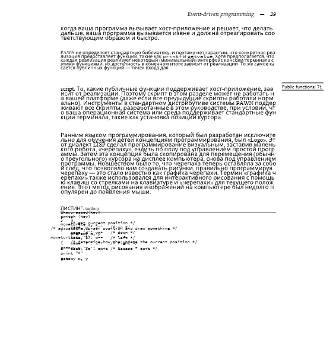
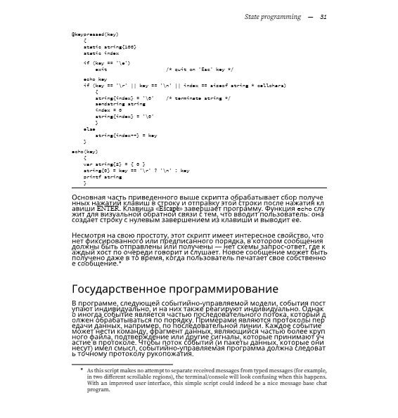
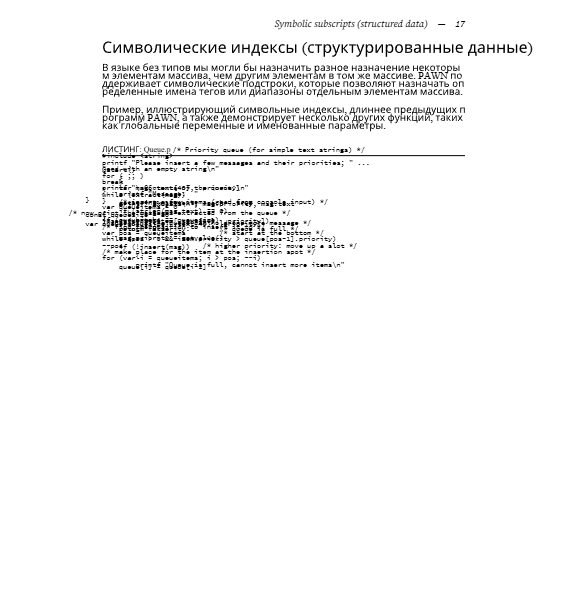

  

<h3>Pawn The Language на Русском</h3>

Документация языка Pawn, переведенная на русский язык с помощью PDFMathTranslate.

---

  
  
  

---

> Все права принадлежат [компании CompuPhase](https://www.compuphase.com/pawn/pawn.htm), оригинальную документацию можно найти в [репозитории CompuPhase](https://github.com/compuphase/pawn/tree/main/doc), перевод выполнен с помощью [PDFMathTranslate](https://github.com/Byaidu/PDFMathTranslate) 
